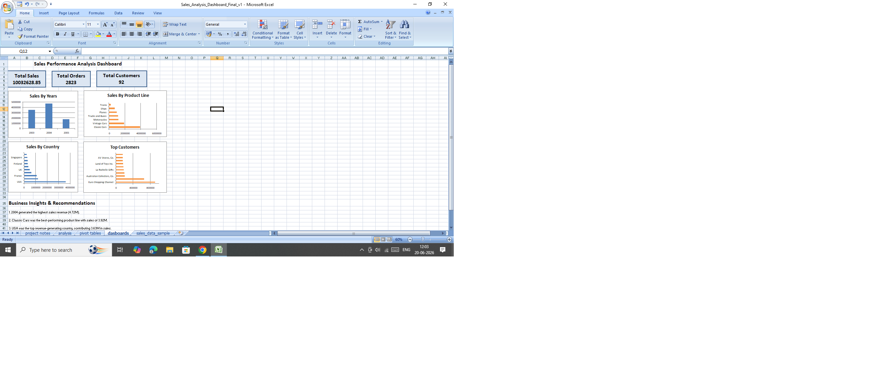

# Sales Performance Analysis Dashboard

## Project Overview
This project analyzes sales performance data using Microsoft Excel. The objective was to identify sales trends, top-performing products, leading countries, and high-value customers.

## Tools Used
- Microsoft Excel
- Data Cleaning
- Pivot Tables
- Pivot Charts
- Dashboard Design
- Business Analysis

## Key Performance Indicators (KPIs)
- Total Sales: 10.03M
- Total Orders: 2823
- Total Customers: 92

## Analysis Performed
- Sales by Year
- Sales by Product Line
- Sales by Country
- Top Customers Analysis

## Key Insights
- 2004 generated the highest sales revenue.
- Classic Cars was the best-performing product line.
- USA was the top revenue-generating country.
- Euro Shopping Channel was the highest-value customer.
- Revenue was concentrated among a small number of products and customers.

## Dashboard Preview

## Author
Anas Malik
Aspiring Data Analyst
